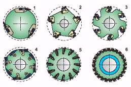

# МЕТОДИЧЕСКИЕ УКАЗАНИЯ ПО ВЫПОЛНЕНИЮ ПРАКТИЧЕСКОЙ РАБОТЫ №4

**Тема**: Изучение правил безопасной эксплуатации оборудования для тонкого измельчения продуктов в замороженном виде.

**Цель работы**:

1.  Закрепить знания о назначении технологического оборудования для измельчения продуктов в замороженном виде.
2.  Произведите технологический  расчет производительности машины.

**Объем времени, отведенный на выполнение практической работы: 2 часа.**

**Материально-техническое оснащение:** Схема устройства куттера

##ТЕОРЕТИЧЕСКИЙ МАТЕРИАЛ ПО ТЕМЕ ПРАКТИЧЕСКОЙ РАБОТЫ

Измельчают замороженные фрукты, овощи или мясную продукцию

**Рекомендуемое оборудование:**

*   Ультрагрануляторы
*   Роторная дробилка типа PZC

**Грануляторы.** Ультрагрануляторы обеспечивают оптимальную производительность в широком спектре областей применения, таких как пластики, химические, минеральные и пищевые продукты, древесина и т.д.

В зависимости от требований имеются различные варианты корпусов оборудования с различным количеством ножей и геометрией движений при нарезании.

Типы и конструкции роторов многофункциональны, как и области их применения:

 

1.  Гильотинный ротор
2.  Ротор с косым срезом
3.  Когтевой ротор
4.  Кассетный ротор
5.  Фиксирующий ротор
6.  Многоножевой ротор

Для удобства в обращении имеют разъемный корпус, верхняя часть которого в зависимости от конструкции может быть вручную или гидравлически поднята или опущена. Конструкция корпуса мельницы обеспечивает легкий доступ к поверхности сита, которая может быть изготовлена с квадратными или круглыми отверстиями. Для того чтобы добиться высокого качества конечного продукта при низких эксплуатационных расходах, требуется точное расстояние между вращающимися и стационарными ножами.

Измельчение осуществляется между вращающимися и неподвижными ножами. Чем точнее установлено расстояние между ножами, тем выше качество продукта и ниже эксплуатационные расходы.

**Дробилки (блокорезки)** значительно ускоряют производственный процесс, измельчая мясо в замороженном виде, исключается вероятность зарождения бактерий, что в последствии увеличивает сроки годности конечной потребительской продукции. **Блокорезки** чаще всего используются для измельчения замороженных блоков мяса на мясоперерабатывающих предприятиях, но они так же могут применяться для измельчения замороженных блоков мяса птицы, рыбы, овощей, масла и многих других продуктов.

Дробилка может измельчать замороженные блоки любой продукции температурой -18 – -0 0С, исключается потребность в оборудовании дефростации, автоматизируется и ускоряется производственный процесс.

Блокорезка измельчает замороженный блок продукции на кусочки весом 2,5-25грамм, вес можно настраивать в зависимости от рецептуры конечной продукции. Получаемые кусочки удобно высыпаются вниз из блока ножей, куда можно подставить любую транспортную тару для их сбора и транспортировки до куттера или волчка.

Элементы привода дробилки размещены в корпусе и закрыты защитными крышками, исключается вероятность попадания посторонних предметов в механическую часть и вероятность загрязнения продукции смазывающими материалами, сохраняется чистота, увеличиваются эксплуатационные сроки механических деталей.

**Куттеры.** Для тонкого окончательного измельчения фарша используют куттеры. Режущий инструмент куттера - серповидный нож. Измельчение происходит при вращении чаши с продуктом и ножей. Однако, применяя куттеры, необходимо предварительно измельчить продукт. 

Куттеры предназначены для тонкого измельчения мясных продуктов при производстве колбас, сосисок, сарделек. В основном они применяются на предприятиях мясоперерабатывающей промышленности, но иногда и в заготовочных цехах предприятий общественного питания при больших объемах производства. В отличии от мясорубок, куттеры обладают большой степенью измельчения вплоть до пюре и пастоообразного состояния.

Куттеры состоят из вращающейся чаши или дежи, внутри которой со значительно большей скоростью (1000 об/мин) вращаются ножи различных форм и конструкций. Причем ось их вращения может располагаться как вертикально, так и горизонтально.

 Горизонтальное расположение оси вращения позволяет снизить нагрузки на ножи и применяется в куттерах с большим объемом дежи (от 20 л и более). Они имеют большие размеры и напольное исполнение. На предприятиях общественного питания чаще применяются куттеры с вертикальной осью вращения дежи и ножей.

В последнее время на предприятиях общественного питания все большее распространение получают так называемые настольные кухонные куттеры с неподвижной чашей в которой установлены многоуровневые ножи, что обеспечивает равномерное измельчение по всему объему. Кухонные куттеры применяются для измельчения не только мяса и рыбы, но также овощей, фруктов, зелени. Кроме того, с их помощью можно взбивать сливочное масло, приготавливать эмульсию (мусс или майонез) и даже замешивать тесто. В крышке кухонных кутеров имеется отверстие 3 для добавления различных ингредиентов в процессе обработки.

Куттеры имеют объем чаши от 2 до 60 литров. Большие куттеры могут быть укомплектованы вакуумным оборудованием, повышающим качество обработки и снижающим шум. Наибольшее распространение в России получили кухонные куттеры фирм «Robot coup» (Франция), «Sirman» и «Fimar» (Италия).

**Требования безопасности при эксплуатации**. Для безопасной разборки режущего механизма при санитарной обработке машины применяют приспособление для отвинчивания зажимной гайки и специальный крючок, прилагаемые в комплекте поставки. Зона вращения ножей куттера и передаточные механизмы должны быть закрыты крышками, сблокированными с пусковым устройством. При открытой любой из крышек куттера должна быть исключена возможность пуска куттера в работу. Для удобной и безопасной выгрузки из чаши переработанного фарша куттер следует обеспечивать тарельчатым выгружателем, сблокированным с пусковым устройством. При подъеме тарелки выгружателя должно прекращаться вращение самой тарелки и чаши куттера. Дежа куттера - мешалки должна иметь предохранительную планку, сблокированную с приводом, обеспечивающую отключение машины при касании рамки дежи. После каждого цикла работы необходимо разбирать ножи, чистить и промывать, проверять состояние остроты. Также необходимо промывать чашу от мясных остатков.

## АЛГОРИТМ ПО ВЫПОЛНЕНИЮ ПРАКТИЧЕСКОГО ЗАДАНИЯ

**Методика выполнения задания:**

Проанализируйте устройство и принцип действия куттера, используя рисунок 1 из [Приложения Д](pril5.md).

Произведите технологический  расчет.

Производительность куттера определяется зависимостью:

$$ \varPi = \alpha · {60 \over t}·V·ρ$$, кг/ч, <a style="float: right;">  (1) </a>

где $$\alpha$$  - коэффициент загрузки чаши куттера;

$$V$$ - емкость чаши куттера, $$м^3$$;

$$ρ$$  - плотность вареных овощей;

$$t$$ - время цикла куттирования, мин.

Плотность вареных овощей 1000 кг/м³. (1 м³ = 1000 литров)

**Порядок оформления работы**

Для составления отчета необходимо начертить схему изучаемой машины.

Провезти расчет производительности машины, используя данные таблицы 1

Замеренные и расчетные величины занесите в таблицу 1.

Таблица 1 – *Данные для расчета производительности куттера*

| Варианты задания | коэффициент загрузки чаши куттера | емкость чаши куттера | время цикла куттирования, мин | Производительность, кг/ч.  |
| --- | --- | --- | --- | --- |
| 1 | 0,5 | 0,05 м³ | 5 |  |
| 1 | 0,6 | 2 литра | 4 |  |
| 3 | 0,5 | 0,06 м³ | 5,5 |  | |

Сделать вывод о проделанной работе.

**КОНТРОЛЬНЫЕ ВОПРОСЫ**

1. Из каких основных частей состоит куттер?
2. Какое количество ножей может иметь куттер?
3. В чем состоит преимущество вакуумных куттеров перед обычными?
4. От чего зависит степень измельчения?
5. Как определить производительность и мощность куттера?
6. Поясните назначение грануляторов.
7. Расскажите требования безопасности при эксплуатации измельчительного оборудования.
8. Поясните назначение блокорезок.

