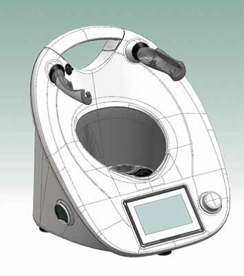

# ПРИЛОЖЕНИЕ  К

**Устройство термомикса**

 *Корпус Термомикс™ TM5*

*Миксерная чаша*

*Подставка миксерной чаши* 

*Уплотнительное кольцо*

*Нож*

*Крышка Varoma*, *Средний уровень приставки*, *Нижняя часть приставки*

*Крышка миксерной чаши*

*Насадка для взбивания («бабочка»)*

 *Лопатка с защитным диском*

*Паровая корзинка*

Рисунок 1 – *Комплектующие термомикса*

