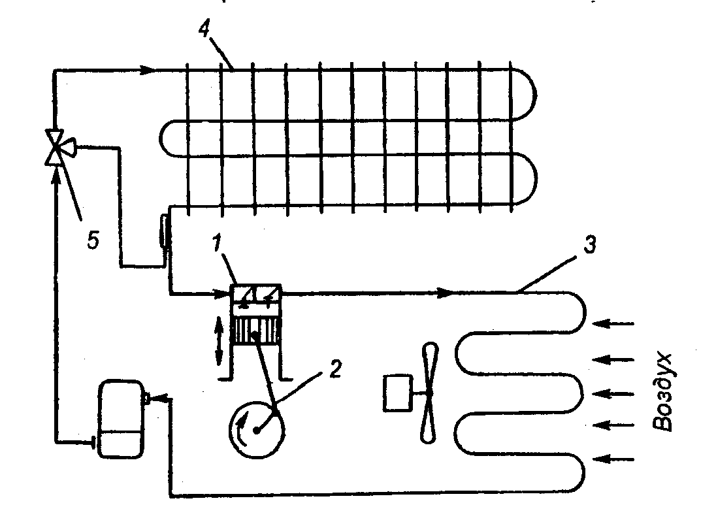

# ПРИЛОЖЕНИЕ  Л

**Схема холодильной установки**

Рисунок 1 – *Схема компрессионной холодильной установки*

1 – компрессор поршневой; 
2 – привод компрессора;
3 – конденсатор; 
4 – испаритель;
5 – терморегулирующий вентиль

