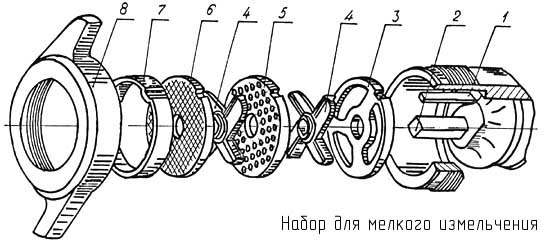
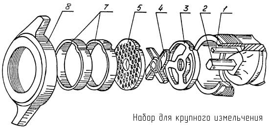
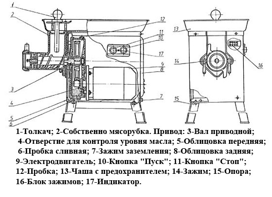

# ПРИЛОЖЕНИЕ В

**Устройство мясорубки МИМ-82**

Рисунок 1 -* Схема сборки мясорубки для разной степени измельчения мяса: 1-шпонка; 2-шнек; 3-нож подрезной; 4-нож двухсторонний; 5-решётка с отверстиями 9мм; 6-решётка с отверстиями 5мм; 7-кольцо упорное; 8-гайка зажимная*

Рисунок 2 – *Устройство мясорубки МИМ-82*

