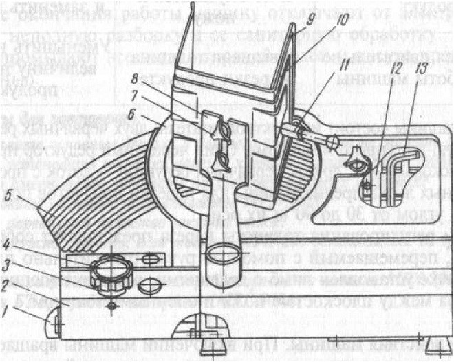

# ПРИЛОЖЕНИЕ Г

**Устройство машины для нарезки гастрономических товаров МРГ-300А**

Рисунок 1 - *Машина для нарезки гастрономических товаров МРГ-300А*

1 - пакетно-кулачковый выключатель, 2 - основание корпуса, 3 - лимб, 4 - ручка, 5 - опорный столик, 6 - нож, 7 - зажим, 8 - рычаг, 9 - подвижная опора, 10 - лоток, 11 - фиксатор, 12 - лопатка, 13 - ключ.

