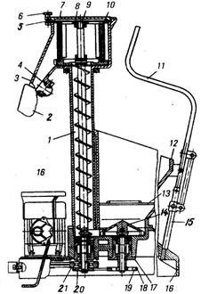

# ПРИЛОЖЕНИЕ Е

**Мукопросеивательные машины и механизмы**

Рисунок 1 – *Машина для просеивания муки МПМ-800*

1-труба, 2-рукав, 3-корпус, 4-магнитная ловушка, 5-откидной болт, 6-гайка,
7-крышка, 8-опоры скребков, 9-шнек, 10-сито, 11-подъемник, 12-бункер, 13-решетки, 14-крыльчатка, 15-крестовина, 16-платформа, 17-стакан, 18-клиновой ремень, 19,20,21-шкивы

