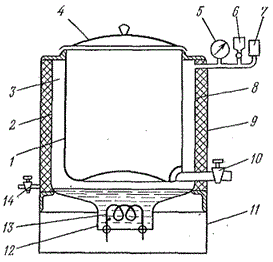

# ПРИЛОЖЕНИЕ Ж

**Котел пищеварочный**

Рисунок 1 - *Схема устройства пищеварочного котла*

1-варочный сосуд , 2-наружный котел, 3- паровая рубашка, 4-откидная крышка,5-манометр, 6-наполнительная воронка, 7 – двойной предохранительный клапан, 8-теплоизоляция, 9 – кожух, 10-сливной кран, 11-постамент,12- парогенератор, 13- нагреватели, 14-кран.

