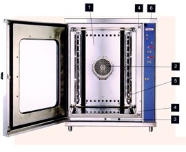

# ПРИЛОЖЕНИЕ И

**Устройство пароконвектомата**

Рисунок 1 – *Пароконвектомат серии FC*

1.	Конструкция жарочной камеры пароконвектоматов серии FC предусматривает закругленные углы во фронтальной части камеры. Благодаря этому техническому приему увеличиваются скорость и равномерность в распределении тепла, облегчается очистка и обеспечивается высокий уровень гигиеничности.
2.	Решетка-фильтр вентилятора.
3.	Желобок для сбора конденсата, который скапливается на стекле и автоматически отводится в сливной желоб. Благодаря этому капли конденсата не падают на пол кухни.
4.	Блокиратор замка дверцы пароконвектомата с двумя крюками захвата, обеспечивающими максимальную надежность системы.
5.	Температурный зонд (щуп) контроля температуры в сердцевине продукта. 
6.	Клапан-заслонка для немедленного выпуска лишнего пара из жарочной камеры.
 

Рисунок 2 – *Бойлерная система*

Рисунок 3 – *Инжекторная система*

Рисунок 4 – *Панель управления*

